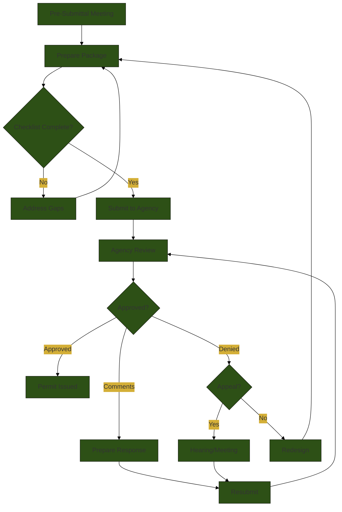
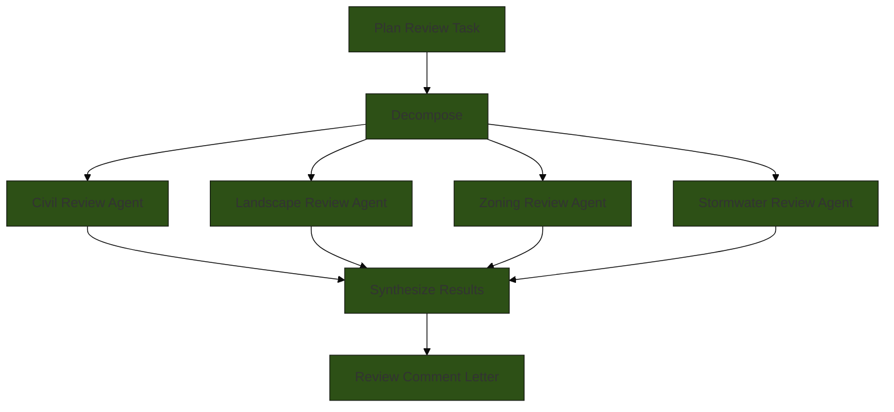
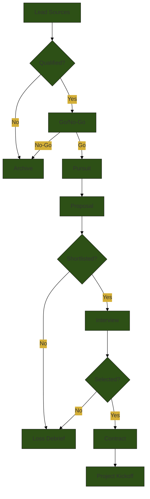
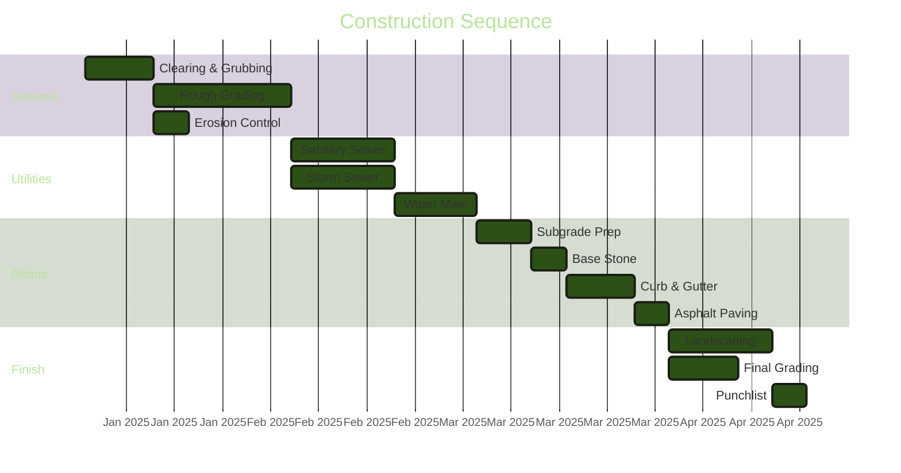

# FigJam — Diagram Generator

## Trigger Phrases
- "diagram this"
- "map this workflow"
- "figjam"
- "visualize this"
- "org chart"
- "flow chart"
- "draw the process"
- "show me the pipeline"

## Purpose

FigJam generates clear, professional Mermaid diagrams from natural language descriptions. It supports all major diagram types, applies JEDS brand styling, and includes pre-built templates for common civil engineering and land development workflows. Output is Mermaid syntax that renders natively in Markdown and HTML artifacts.

## Supported Diagram Types

| Type | Mermaid Keyword | Best For |
|------|----------------|----------|
| **Flowchart** | `flowchart TD/LR` | Process flows, decision trees, approval workflows |
| **Sequence** | `sequenceDiagram` | Communication flows, API calls, agency interactions |
| **Gantt** | `gantt` | Project schedules, timelines, phase planning |
| **State** | `stateDiagram-v2` | Status tracking, lifecycle management, permit stages |
| **Mindmap** | `mindmap` | Brainstorming, topic decomposition, risk categories |
| **Quadrant** | `quadrantChart` | Priority matrices, risk/impact analysis, positioning |
| **Class** | `classDiagram` | Data models, system component relationships |
| **ER** | `erDiagram` | Database schemas, entity relationships |
| **Pie** | `pie` | Distribution breakdowns, budget allocation |
| **Timeline** | `timeline` | Historical events, project milestones |

## Execution Phases

### Phase 1: Understand the Request

1. **Identify the diagram type** — auto-detect from the user's description:
   - Process/workflow/steps/approval --> Flowchart
   - Communication/handoffs/back-and-forth --> Sequence
   - Schedule/timeline/milestones/phases --> Gantt
   - Status/lifecycle/transitions --> State
   - Categories/breakdown/brainstorm --> Mindmap
   - Priority/impact/comparison matrix --> Quadrant
   - Relationships/structure/hierarchy --> Class or ER
2. **Identify the content:**
   - What entities/nodes are involved?
   - What are the connections/flows between them?
   - What are the labels, conditions, or annotations?
3. **Identify the audience:**
   - Internal team? (can be detailed, technical)
   - Client presentation? (clean, high-level, branded)
   - Agency submittal? (formal, complete, precise)

### Phase 2: Gather Content

1. **Check for existing diagrams** — Grep the repo for related Mermaid code or process documentation.
2. **Check memory files** for process descriptions or workflow documentation.
3. **If describing a JEDS pattern**, use the pre-built template (see below) as a starting point.
4. **Ask clarifying questions** only if the diagram would be fundamentally wrong without them.

### Phase 3: Build the Diagram

1. **Start with the correct Mermaid type declaration.**
2. **Apply JEDS brand styling** using the theme configuration:

```
%%{init: {'theme': 'base', 'themeVariables': {
  'primaryColor': '#2D5016',
  'primaryTextColor': '#FFFFFF',
  'primaryBorderColor': '#1A3009',
  'secondaryColor': '#D4AF37',
  'secondaryTextColor': '#1A1A1A',
  'secondaryBorderColor': '#B8960F',
  'tertiaryColor': '#F5F0E1',
  'tertiaryTextColor': '#1A1A1A',
  'lineColor': '#2D5016',
  'fontFamily': 'Inter, system-ui, sans-serif',
  'fontSize': '14px'
}}}%%
```

3. **Build the structure:**
   - Use descriptive node IDs (not single letters): `submittal_prep` not `A`
   - Keep labels concise: 3-5 words per node
   - Use subgraphs to group related elements
   - Add decision diamonds for branching logic
   - Use link labels for conditions or descriptions
4. **Optimize readability:**
   - Direction: TD (top-down) for hierarchies, LR (left-right) for timelines/processes
   - Limit to 15-20 nodes max per diagram. Split if larger.
   - Use consistent node shapes: rectangles for actions, diamonds for decisions, rounded for start/end, stadiums for data

### Phase 4: Deliver

1. **Present the diagram** in a code block with `mermaid` language tag.
2. **Add a legend** if the diagram uses color coding or special shapes.
3. **Provide a plain-text summary** for accessibility and for those who prefer text.
4. **Offer to create an artifact** if the diagram is for presentation or sharing.

## JEDS Brand Colors Reference

| Color | Hex | Usage |
|-------|-----|-------|
| Dark Green | `#2D5016` | Primary nodes, connecting lines |
| Gold | `#D4AF37` | Secondary nodes, highlights, milestones |
| Cream | `#F5F0E1` | Background, tertiary nodes |
| Dark Green (darker) | `#1A3009` | Borders, text on light backgrounds |
| White | `#FFFFFF` | Text on dark backgrounds |

## Pre-Built Templates

### Template: Project Delivery Pipeline

```mermaid
%%{init: {'theme': 'base', 'themeVariables': {'primaryColor': '#2D5016', 'secondaryColor': '#D4AF37', 'tertiaryColor': '#F5F0E1'}}}%%
flowchart LR
    subgraph Pursuit
        lead[Lead Identified] --> qualify[Qualify]
        qualify --> proposal[Proposal]
        proposal --> award[Award]
    end
    subgraph Design
        kickoff[Kickoff] --> cd30[30% Design]
        cd30 --> cd60[60% Design]
        cd60 --> cd90[90% Design]
        cd90 --> final[Final Plans]
    end
    subgraph Permitting
        submit[Agency Submit] --> review[Review]
        review --> comments[Comments]
        comments --> revise[Revise]
        revise --> approve[Approval]
    end
    subgraph Construction
        preconstruction[Pre-Con Meeting] --> observe[Observation]
        observe --> punchlist[Punchlist]
        punchlist --> closeout[Closeout]
    end
    award --> kickoff
    final --> submit
    approve --> preconstruction
```



### Template: Agency Submittal Flow



### Template: Plan Review Swarm



### Template: Client Acquisition Funnel



### Template: Construction Sequencing



## Rules

- **Always apply JEDS brand colors** unless the user specifies a different color scheme.
- **Keep diagrams readable.** 15-20 nodes max. Split complex processes into multiple diagrams.
- **Use descriptive node IDs.** `agency_review` not `ar` or `A5`.
- **Label all connections** where the relationship is not obvious.
- **Include a title** using the Mermaid `title` directive or a markdown heading.
- **Test syntax validity.** Mermaid syntax errors are common — double-check bracket matching, arrow syntax, and keyword spelling.
- **Offer both code and artifact.** Show the Mermaid code for embedding, and offer to render as an HTML artifact for presentation.
- **Direction matters.** TD for hierarchies and approval flows. LR for timelines and sequential processes.

## Output Format

For each diagram, deliver:

1. **Diagram Title** — what this diagram shows
2. **Mermaid Code Block** — ready to paste into any Markdown renderer
3. **Plain-Text Summary** — 2-3 sentence description of what the diagram shows
4. **Customization Notes** — what the user might want to change (dates, labels, additional nodes)
